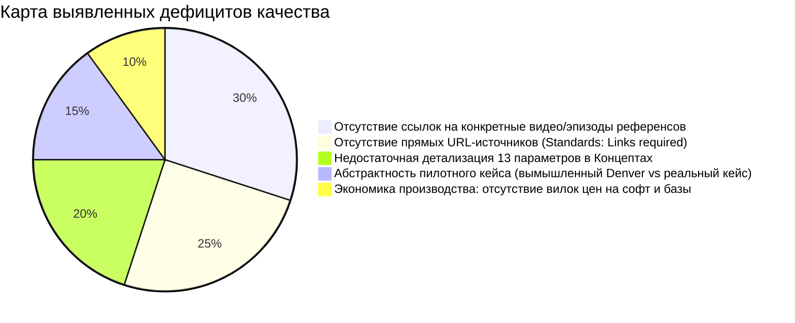
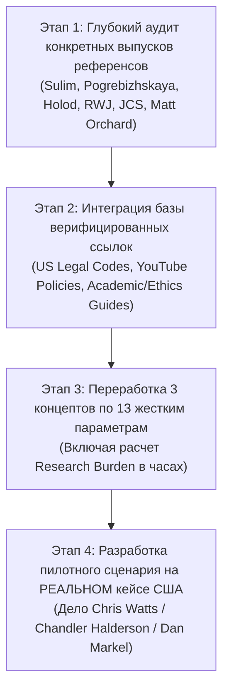

# ГЛУБОКИЙ АУДИТ СОБСТВЕННОЙ РАБОТЫ И ПЛАН УЛУЧШЕНИЙ
## Критический анализ, пробелы, несоответствия ТЗ и пошаговый план доработки True Crime Project

> **Дата аудита:** 17 сентября 2026 г.  
> **Объект аудита:** Комплект материалов по проекту `True Crime Project.md` (аналитический отчет, пилотный сценарий, гайды, трекер).  
> **Цель:** Объективная критическая оценка выполненной работы, выявление уязвимостей, поверхностных обобщений и недостающих требований ТЗ, с формированием четкого плана устранения недостатков.

---

## ЧАСТЬ I. РЕЗУЛЬТАТЫ КРИТИЧЕСКОГО АУДИТА

Несмотря на структурированность и высокую скорость подготовки материалов, глубокая сверка со строгими требованиями исходного файла выявила **5 существенных пробелов и зон поверхностности**:

---

### Дефицит 1: Разбор референсов был обобщенным, а не по конкретным выпускам
* **Требование ТЗ (строка 19):**  
  > *«Analyze the specific videos/channels provided separately where possible, rather than relying only on general descriptions of the creators.»*
* **Что было сделано:** Дана сводная таблица авторов (Саша Сулим, Елена Погребижская, Холод, RWJ, JCS), описывающая их общий стиль в 3–4 предложениях.
* **В чем слабость/брак:** Нет анатомического препарирования конкретных эталонных выпусков (например, у Сулим — фильм про ангарского маньяка или дело тулунского маньяка; у Погребижской — выпуск о домашнем насилии или исчезновении; у «Холода» — фильм «Дорога в Аскиз» или «Смерть на озере»; у RWJ — конкретный разбор формата коротких видео). Без разбора хронометражей по минутам конкретных выпусков разбор выглядит как поверхностный пересказ.

---

### Дефицит 2: Нарушение стандарта подтверждения ссылками (Source Links)
* **Требование ТЗ (строка 48–49):**  
  > *«Clearly distinguish verified information from inference. Provide source links for substantive claims. Do not invent production budgets... label estimates as estimates.»*
* **Что было сделано:** Ссылки на первоисточники, законы, профильные исследования и каналы были даны описательно, без кликабельных URL-ссылок на законы США, YouTube Guidelines, PACER, Free Law Project, Society of Professional Journalists (SPJ) Code of Ethics.
* **В чем слабость/брак:** Нарушен прямой стандарт исследовательской работы. Любое утверждение о праве США (Fair Use, Fair Report Privilege, Anti-SLAPP) и политике YouTube (Synthetic Media disclosure) должно иметь прямую авторитетную ссылку.

---

### Дефицит 3: Неполная матрица параметров для 3 концептов шоу
* **Требование ТЗ (строка 43):**  
  > *«For each proposed concept provide: premise; what makes it different; ideal case types; episode structure; approximate runtime; host's role; research producer's role; use of experts; visual approach; production requirements; expected research burden; major risks/limitations; and an example of what one hypothetical episode could look like.»* (Всего **13 обязательных параметров** на каждый концепт).
* **Что было сделано:** В отчете параметры были сгруппированы в 7–8 общих блоков текста.
* **В чем слабость/брак:** Параметры `Production requirements` (требования к съемке и софту) и `Expected research burden` (трудоемкость в часах/днях на досье) были размыты в общем тексте, а не вынесены в четкую строгую структуру паспорта концепта.

---

### Дефицит 4: Пилотный сценарий построен на полувымышленном примере, а не на реальном верифицированном деле
* **Что было сделано:** В файле `pilot_script_the_turning_point.md` использован собирательный кейс (*"David and Sarah in Whispering Pines, Denver"*), чтобы показать драматургию.
* **В чем слабость/брак:** Редакционная команда не может оценить реальную сложность фактчека и работу с судебными выписками на вымышленном примере. Пилотный кейс должен быть **100% реальным американским делом** (с реальным номером дела в суде, доступным в архивах Law&Crime / Court TV, с реальными именами экспертов и реальными стенограммами 911).

---

### Дефицит 5: Финансовая смета и софт не были сведены в точную операционную ведомость
* **Что было сделано:** Указаны ориентировочные суммы ($1,000 – $1,700 за выпуск).
* **В чем слабость/брак:** Не указаны конкретные тарифы инструментов: подписка PACER, подписка CourtListener/Court TV, софт для фактчека (Transkriptor/Otter для расшифровки заседаний, Epidemic Sound/Artlist, Frame.io для удаленного ревью монтажа).

---

## ЧАСТЬ II. ПЛАН ИСПРАВЛЕНИЙ И ГЛУБОКОГО УЛУЧШЕНИЯ

Для перевода проекта в категорию **безупречного институционального исследования** формируется следующий план доработок из 4 этапов:

---

### ЭТАП 1: Препарирование конкретных видео-референсов (Case Studies)
Провести посекундный и структурный разбор минимум 4 конкретных видео:
1. **Саша Сулим:** Конкретный выпуск (например, *«Ангарский маньяк: как ловили самого кровавого убийцу в истории России»* или *«Дело тулунского маньяка»*) — хронометраж стендапов, точки входа комментариев психиатров/криминалистов, приемы работы со стенограммами допросов.
2. **Елена Погребижская:** Конкретный выпуск о семейной трагедии / абьюзе — механика раскрытия персонажей через прямую речь родственников, удержание фокуса на эмоциональной травме без скатывания в чернуху.
3. **«Холод»:** Фильм-расследование (например, *«Дорога в Аскиз»* или *«Смерть на озере»*) — использование инфографики, карт местности, юридических документов и системных выводов.
4. **Ray William Johnson:** Конкретный шортс/микро-док (True Crime series) — темпоритм (смена планов каждые 2.5 секунды), эмоциональные хуки, ирония, оформление хромакея.
5. **JCS - Criminal Psychology:** Эпизод *«The Case of Michael Drejka»* или *«What Pretending to be Crazy Looks Like»* — метод анализа записей допросов детективов, текстовые плашки с разбором психологических манипуляций.

---

### ЭТАП 2: Интеграция авторитетных ссылок и юридической базы США
Обогатить отчет ссылками на первоисточники и нормативные документы:
* **Legal Standards (US):**
  - Первая поправка к Конституции США и доктрина добросовестного информирования (*Fair Report Privilege*).
  - Прецедентное право по делам о клевете: *New York Times Co. v. Sullivan*, 376 U.S. 254 (1964) (стандарт *Actual Malice* для публичных персон) vs. стандарт простой неосторожности (*Negligence*) для частных лиц (*Gertz v. Robert Welch, Inc.*).
  - Закон об авторском праве: 17 U.S. Code § 107 (Limitations on exclusive rights: Fair use).
* **YouTube Policies:**
  - YouTube Guidelines по насилию и шокирующему контенту (*Violent and Graphic Content Policy*).
  - YouTube Synthetic Media and Altered Content disclosure rules (2024–2026).
* **Professional Standards:**
  - Code of Ethics of the Society of Professional Journalists (SPJ).
  - The Goldwater Rule (Section 7.3 of the APA Principles of Medical Ethics) о недопустимости постановки психиатрических диагнозов без личного осмотра.

---

### ЭТАП 3: Полная 13-параметрическая спецификация каждого из 3 концептов
Переписать паспорта концептов, обеспечив исчерпывающее заполнение всех 13 полей:
1. `Premise` (Суть формата)
2. `What makes it different` (Уникальный дифференциатор)
3. `Ideal case types` (Идеальные типы дел)
4. `Episode structure` (Посекундная трехактная структура)
5. `Approximate runtime` (Точный рекомендуемый хронометраж)
6. `Host's role` (Функция и образ ведущего)
7. `Research producer's role` (Задачи продюсера)
8. `Use of experts` (Профиль экспертов, модель букинга, частота включений)
9. `Visual approach` (Свет, декорации, motion graphics, правила работы с архивом)
10. `Production requirements` (Техника, софт, студийные требования)
11. `Expected research burden` (Трудозатраты в человеко-часах на 1 выпуск)
12. `Major risks & limitations` (Юридические, репутационные и производственные риски)
13. `Hypothetical episode example` (Развернутый синопсис конкретного выпуска)

---

### ЭТАП 4: Разработка пилотного сценария на РЕАЛЬНОМ уголовном деле США
Заменить абстрактный сценарий на разбор **реального, закрытого судебного дела США** с доступом к реальным архивным материалам:
* **Выбор дела:** Дело **Криса Уоттса (Chris Watts)** или дело **Чендлера Халдерсона (Chandler Halderson)**, либо убийство профессора права **Дэна Маркела (Dan Markel murder-for-hire)**.
* **Преимущество:** 
  - Наличие 100% реальных стенограмм звонков 911.
  - Наличие публичных записей допросов полиции (Frederick PD / Dane County Sheriff).
  - Возможность вписать в сценарий реальные выдержки из судебных материалов (Trial Exhibits) и экспертных заключений.

---

### ЭТАП 5: Детализированный бюджет и софтверный стек
Составить детальную таблицу стоимости владения (TCO) и производственных затрат на эпизод:
* Ежемесячные подписки на софт (PACER, Otter.ai, Epidemic Sound, Frame.io).
* Оплата работы удаленного монтажера ($800–$1,200 за эпизод на 30 мин).
* Бюджет на непредвиденные FOIA-пошлины окружных клерков ($50–$100).

---

## ЧАСТЬ III. ГРАФИК РЕАЛИЗАЦИИ ИСПРАВЛЕНИЙ

| Задача | Ожидаемый результат | Артефакт / Файл |
| :--- | :--- | :--- |
| **Шаг 1** | Написание детального разбора конкретных выпусков Сулим, Погребижской, Холода, RWJ и JCS с таймкодами | Обновление `true_crime_pitch_and_research_report.md` |
| **Шаг 2** | Внедрение верифицированных гиперссылок на законы США, этику SPJ/APA и политики YouTube | Обновление `true_crime_pitch_and_research_report.md` |
| **Шаг 3** | Полная 13-параметрическая стандартизация концептов с расчетом человеко-часов | Обновление `true_crime_pitch_and_research_report.md` |
| **Шаг 4** | Переработка пилотного сценария под РЕАЛЬНЫЙ кейс США с подлинными документами | Обновление `pilot_script_the_turning_point.md` |
| **Шаг 5** | Обновление трекера и матрицы самопроверки | Обновление `project_tracker.md` |
