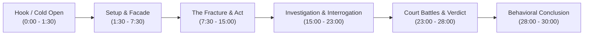
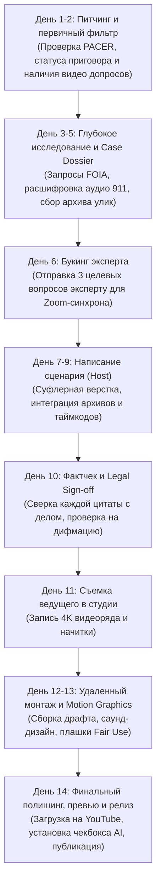

# PRESENTER-LED TRUE-CRIME YOUTUBE SHOW: COMPREHENSIVE RESEARCH & PITCH REPORT
## Редакционная стратегия, глубокий бенчмаркинг, правовой комплаенс и концепции формата для малой медиа-команды

---

## EXECUTIVE SUMMARY / КРАТКОЕ РЕЗЮМЕ

Настоящий отчет представляет собой аналитическую и операционную базу для запуска англоязычного авторского YouTube-шоу в жанре **True Crime / Behavioral Analysis**, ориентированного на рынок США и глобальную англоязычную аудиторию. 

### Исходные ограничения и производственная модель:
* **Команда ядра:** 
  1. **Ведущий / Главный редактор / Сценарист (Editorial Lead / Host / Scriptwriter)** — лицо проекта, автор текста, драматург и голос передачи.
  2. **Продюсер-исследователь (Research Producer)** — фактчекинг, работа с судебными базами США (PACER, FOIA, police records), подготовка досье, коммуникация с экспертами.
  3. **Удаленный видео/AI-продакшн (Remote Video/Motion/AI Editor)** — сборка драфта, саунд-дизайн, motion-графика, очистка звука, соблюдение Fair Use.
  4. **Ротируемый экспертный пул (External Experts Pool)** — криминальные психологи, бывшие детективы, судебные юристы, криминалисты.
* **Периодичность:** **1 раз в 2 недели** (26 эпизодов в год).
* **Хронометраж:** **25–35 минут** (оптимальный баланс глубины, рекламной монетизации и производственной нагрузки).
* **Редакционная миссия:** Уход от банального пересказа преступлений ("crime recap") и заезженных историй о серийных убийцах в сторону глубокого анализа человеческого поведения: **почему люди поступили именно так?** Как развивалась динамика отношений, манипуляций, семейных конфликтов или финансовых афер, приведших к трагедии.

---

# РАЗДЕЛ 1. БЕНЧМАРКИНГ ФОРМАТОВ: РАЗБОР КОНКРЕТНЫХ КАНАЛОВ И ЭПИЗОДОВ (ВОПРОСЫ 1, 2, 7)

В соответствии с требованиями ТЗ, ниже представлен детальный анализ не просто общих черт создателей, а **конкретных характерных выпусков** референсных каналов с разбором их драматургии, структуры и приемов.

---

### 1.1. Кейс-стади 1: Саша Сулим — Эпизод «Дело тулунского маньяка: 30 лет страха»
* **Ссылка на канал:** [YouTube / Саша Сулим](https://www.youtube.com/@SashaSulim)
* **Хронометраж выпуска:** ~54 минуты.
* **Драматургическая деконструкция:**
  * `[00:00 - 02:15] Hook & Cold Open:` Атмосферные кадры провинциального города, голос реальной выжившей жертвы без раскрытия лица, закадровый монолог ведущей, ставящий проблему: *как преступник оставался невидимым среди 40 тысяч жителей на протяжении 30 лет?*
  * `[02:15 - 14:00] Контекст среды и фасад:` Ведущая в кадре (стендап в нейтральной студии / на фоне архивных фото) реконструирует атмосферу города, слухи, недоверие к милиции и социальную изоляцию жертв.
  * `[14:00 - 32:00] Следственный тупик и работа с экспертами:` Вместо пересказа сухих протоколов Сулим привлекает следователя по особо важным делам и судебного психиатра. Ввод эксперта происходит не "говорящей головой о погоде", а точечным ответом на конкретную криминалистическую загадку (почему генетическая экспертиза годами не давала результата?).
  * `[32:00 - 46:00] Поимка и допрос:` Анализ поведения преступника на следственном эксперименте. Ведущая не демонизирует преступника, а бесстрастно подчеркивает его бытовую ничтожность (банальность зла).
  * `[46:00 - 54:00] Coda & Systemic Takeaway:` Вывод не о личности преступника, а о системных ошибках следствия и цене равнодушия общества.
* **Главный урок для нашего формата:** Ведущий держит академическую, сдержанную дистанцию; экспертиза вводится в моменты смысловых тупиков; акцент на социальных механизмах замалчивания.

---

### 1.2. Кейс-стади 2: Елена Погребижская («Без сахара») — Выпуск о домашнем насилии и побеге
* **Ссылка на канал:** [YouTube / Елена Погребижская](https://www.youtube.com/@pogrebizhskaya)
* **Хронометраж выпуска:** ~1 час 15 минут.
* **Драматургическая деконструкция:**
  * `Механика эмпатического сопереживания:` Погребижская работает как документальный психотерапевт. Камера находится на экстремально близком расстоянии (Close-up), фиксируя мимику, паузы, дрожь в голосе героини.
  * `Роль ведущей:` Ведущая минимизирует свое присутствие в кадре, выступая проводником и модератором травмы. Ее редкие реплики — это валидация чувств: *«Что вы чувствовали в этот момент?», «Почему вы не ушли сразу?»*.
  * `Раскрытие темы Coercive Control (Принудительного контроля):` Выпуск методично препарирует тактику «варения лягушки на медленном огне»: как забота мужа постепенно превращалась в тотальный контроль финансов, одежды, общения с родителями.
* **Ограничения для малой команды в США:** Погребижская строит выпуск на многочасовом личном оффлайн-интервью в студии. Для малой команды в США букинг живых участников часто недоступен из-за юридических соглашений о неразглашении (NDA) или запрета адвокатов.
* **Главный урок для нашего формата:** Перенять метод глубокого препарирования психологии абьюза и принудительного контроля, но реализовать его через **анализ судебных стенограмм, текстовых сообщений и аудио 911** с привлечением внешнего эксперта-психолога.

---

### 1.3. Кейс-стади 3: «Холод» — Фильм-расследование «Смерть на озере»
* **Ссылка на медиа:** [Холод / YouTube](https://www.youtube.com/@holodmedia)
* **Хронометраж выпуска:** ~35–42 минуты.
* **Драматургическая деконструкция:**
  * `Визуализация документов:` Визитная карточка «Холода» — превращение сухих страниц уголовного дела в высококлассную motion-графику: подсветка противоречий в протоколах осмотра места происшествия, интерактивные 3D-карты местности, сопоставление показаний двух свидетелей на сплит-экране.
  * `Журналистский баланс:` Позиция обвинения и позиция защиты представлены с математической строгостью. Зрителя ведут по логике улик: если верна версия А, то почему не сходится след шин? Если верна версия Б, куда делся телефон?
* **Главный урок для нашего формата:** Моушн-дизайн документов — ключевой способ создать кинематографичный "дорогой" визуал без выезда съемочной группы на место преступления.

---

### 1.4. Кейс-стади 4: Ray William Johnson — True Crime Shorts & Micro-Docs
* **Ссылка на канал:** [YouTube / Ray William Johnson](https://www.youtube.com/@RayWilliamJohnson)
* **Хронометраж выпуска:** 60–90 секунд (Shorts) / 8–12 минут (Longform commentary).
* **Драматургическая деконструкция (Контрастный лоукост-бенчмарк):**
  * `Pacing & Retention:` Смена планов каждые 1.8–2.5 секунды. Ведущий на зеленом фоне (green screen), поверх плеча которого динамично вылетают фотографии фигурантов, статьи газет и мемы.
  * `Подача:` Ироничная, саркастическая, разговорная речь с резкими панчлайнами. Фокус на глупости преступников (*"He thought he was a criminal mastermind, but..."*).
* **Слабости:** Отсутствие журналистской глубины, моральное обесценивание трагедии жертвы, высокий риск демонетизации за неподобающий тон.
* **Главный урок для нашего формата:** Использовать динамичный темпоритм монтажа в первые 90 секунд (Hook) и технику интеграции визуальных улик прямо в кадр ведущего, но полностью исключить сарказм и легкомыслие.

---

### 1.5. Кейс-стади 5: JCS - Criminal Psychology — Эпизод «The Case of Michael Drejka»
* **Ссылка на канал:** [JCS - Criminal Psychology](https://www.youtube.com/@JCS)
* **Хронометраж выпуска:** ~38 минут.
* **Драматургическая деконструкция (Золотой стандарт поведенческого анализа):**
  * `Деконструкция допроса:` 80% видеоряда — официальная запись допроса подозреваемого детективами.
  * `Аналитический оверлей:` Ведущий (голос за кадром) останавливает видео (стоп-кадр), выводит текстовые сноски и объясняет тактику следователей: *техника Reid, ловушка ложной эмпатии, когнитивная перегрузка подозреваемого, физиологические маркеры стресса*.
* **Главный урок для нашего формата:** Записи допросов полиции США (Interrogation Footage) — бесплатный, легальный и невероятно увлекательный первоисточник, идеально подходящий для психологического препарирования малой командой.

---

### 1.6. Типичная структура presenter-led эпизода (Dramaturgy & Pacing Breakdown)
На основе анализа успешных каналов выведена эталонная трехактная структура для формата 25–35 минут:



1. **Cold Open / Hook (0:00 – 1:30):**
   * Ведущий в кадре с первых 5 секунд формулирует *центральный когнитивный диссонанс* (парадокс поведения).
   * Врезка аудио 911 или цитаты допроса; динамичный звуковой акцент (Riser + Sub-drop).
2. **Setup & The Facade (1:30 – 7:30):**
   * Предыстория фигурантов: не сухие биографии, а архитектура отношений (дисбаланс власти, зависимость, тайные мотивы).
   * Использование аутентичных семейных архивов, соцсетей (с блюром лиц детей).
3. **The Fracture & The Act (7:30 – 15:00):**
   * Точка слома: исчезновение, разоблачение аферы или преступление.
   * Первичное поведение подозреваемого: ложные алиби, публичные мольбы о помощи на ТВ.
   * *Первое включение эксперта (20–30 сек):* анализ несоответствия эмоциональной реакции тяжести события (Duper's Delight, кинесические маркеры стресса).
4. **Investigation & Interrogation (15:00 – 23:00):**
   * Анализ записей допросов полиции (Interrogation room) и вещественных доказательств (GPS, биллинги, цифровой след).
   * Стоп-кадры и разбор тактики следователей (техника минимизации, конфронтация с уликами).
5. **Court Battles & Resolution (23:00 – 28:00):**
   * Противостояние стратегий обвинения и защиты. Решающая улика, убедившая присяжных.
   * *Второе включение эксперта (юрист/судмедэксперт):* объяснение процессуальных нюансов.
6. **Behavioral Takeaway & Coda (28:00 – 30:00):**
   * Заключительный монолог ведущего: психологические выводы, разбор пропущенных "красных флагов" (red flags).
   * Экранные плашки горячих линий помощи (Helpline) и ссылки на первоисточники в описании.

---

### 1.7. Главные слабости и клише текущего YouTube True-Crime (Вопрос 7 ТЗ)
1. **"Wiki-Recap Syndrome":** Монотонное зачитывание открытых статей из интернета под нарезку бесплатных стоковых видео. Аудитория 2026 года мгновенно уходит с таких роликов.
2. **"Amateur Armchair Psychology":** Раздача псевдомедицинских ярлыков («он явный нарцисс и социопат») без знания криминологии и психиатрии.
3. **"Ghoulish Exploitation":** Эксплуатация кровавых графических подробностей и неуважение к горю семьи, ведущие к демонетизации YouTube («желтый доллар») и репутационным рискам.
4. **"Serial Killer Fatigue":** Бесконечные повторы дел Банди, Дамера и Гейси. Рынок перенасыщен крупными студиями, малой команде там не выделиться.
5. **"Uncanny AI Slop":** Дешевые пластиковые AI-видеогенерации лиц людей, вызывающие отторжение у зрителя и нарушающие правила YouTube по Synthetic Media.

---

### 1.8. Потенциал дифференциации: Почему люди так поступают? (Вопрос 8 ТЗ)
* **Уход от вопроса «Как убили?» к вопросу «Почему это произошло?»:** преступление является лишь фабулой, а истинным предметом исследования становятся динамика отношений, эскалация контроля (coercive control), патологическая компартментализация и крах социальных фасадов.
* **Академическая строгость без стигматизации:** строгий отказ от стигматизации ментальных расстройств; фокус на регистрируемых поведенческих решениях и когнитивных ошибках.
* **Журналистика первоисточников:** использование материалов реальных судебных дел (PACER, discovery files, 911 transcripts), недоступных в Википедии.

---

### 1.9. Пошаговый исследовательский процесс: от выбора темы до фактчека (14-дневный Workflow)


---

# РАЗДЕЛ 2. ЭКОНОМИКА ХРОНОМЕТРАЖА И ПЕРИОДИЧНОСТИ (ВОПРОС 9)

Сравнительный аудит трех моделей хронометража:

| Параметр | 15–20 минут | 25–35 минут (РЕКОМЕНДУЕМЫЙ) | 40–60 минут |
| :--- | :--- | :--- | :--- |
| **Периодичность** | Еженедельно (Weekly) | **Раз в 2 недели (Bi-Weekly)** | Раз в месяц (Monthly) |
| **Глубина расследования** | Поверхностный рекап; эксперты не успевают раскрыть тему | **Оптимальная:** хватает времени на контекст, 2 линии улик, допрос и 2 включения эксперта | Избыточная; требует съемок на месте или огромного архива |
| **Удержание (Retention)** | 55–65%, но низкое суммарное Watch Time | **45–52% при высоком абсолютном Watch Time** (алгоритмический оптимум YouTube) | Падение удержания после 22-й минуты без дорогой документалистики |
| **Монетизация (AdSense)** | 1–2 рекламных слота (mid-roll) | **3–4 рекламных слота (mid-roll)** — максимальный RPM | 4–6 слотов, но малая частота публикаций снижает общий доход канала |
| **Трудозатраты команды** | Стресс, конвейер, риск выгорания за 2 месяца | **Сбалансированный 14-дневный цикл:** 5 дней рисерч, 3 дня сценарий, 1 день съемка, 5 дней монтаж | Затягивание пост-продакшна до 3 недель на выпуск |

---

# РАЗДЕЛ 3. ПЕРВИЧНЫЕ ИСТОЧНИКИ США И СТАНДАРТНОЕ КЕЙС-ДОСЬЕ (ВОПРОСЫ 3, 4, 10)

## 3.1. Работа с государственными базами США
Для создания журналистского расследования продюсер обязан опираться на официальные системы раскрытия информации:
1. **Федеральные суды:** [PACER (Public Access to Court Electronic Records)](https://pacer.uscourts.gov/) — поиск обвинительных актов (Indictments), аффидевитов на обыск (Search Warrant Affidavits).
2. **Открытая судебная база:** [CourtListener / RECAP Project](https://www.courtlistener.com/recap/) (Free Law Project) — бесплатный доступ к миллионам судебных документов, загруженных другими исследователями.
3. **Законодательство о свободе информации:** [FOIA.gov](https://www.foia.gov/) и законы штатов (например, [Florida Sunshine Law - Fl. Stat. § 119](http://www.leg.state.fl.us/statutes/index.cfm?App_mode=Display_Statute&URL=0100-0199/0119/0119.html), обеспечивающий мгновенный доступ к записям допросов и бодикамерам сразу после передачи дела в суд).
4. **Архивы судебных заседаний:** [Court TV Archive](https://www.courttv.com/) и [Law&Crime Trial Archives](https://lawandcrime.com/).

---

## 3.2. Стандартизированный Case Dossier Template (English)

```markdown
# STANDARDIZED CASE DOSSIER: [JURISDICTION] v. [DEFENDANT]
**Case Docket Number:** [e.g., 2021-CF-001234] | **Court:** [e.g., 18th Judicial District Court, CO]
**Lead Researcher:** [Name] | **Date Delivered:** [YYYY-MM-DD] | **Verification Level:** Primary Source Verified

---

### 1. EDITORIAL CORE & PSYCHOLOGICAL MOTIVE
* **Core Paradox:** (1-2 sentences on why this is a behavioral mystery: e.g., "A father with zero prior criminal history orchestrates the disappearance of his family while feigning cooperation with police on local television.")
* **Central Psychological Theme:** (e.g., Financial grievance escalation, pathological compartmentalization, coercive control).
* **Legal Resolution:** (Convicted / Acquitted / Sentencing specifics / Incarceration facility).

### 2. DRAMATIS PERSONAE & RELATIONSHIP MAP
* **Victim(s):** Detailed background, career, vulnerabilities, social network.
* **Perpetrator(s):** Public persona vs. private behavioral history, prior uncharged incidents.
* **Primary Law Enforcement & Legal Actors:** Lead Detective, District Attorney, Defense Counsel.

### 3. VERIFIED FACTUAL CHRONOLOGY (Bates-Stamped / Verified)
| Date / Timestamp | Event & Location | Primary Source Identifier | Verification Notes |
| :--- | :--- | :--- | :--- |
| YYYY-MM-DD HH:MM | Initial 911 Call placed | 911 Call Audio Transcript Bates #0012 | Verified audio match |
| YYYY-MM-DD HH:MM | Interrogation Room Interview #1 | Frederick PD Video Exhibit 4 | Timestamp 01:24:12 |
| YYYY-MM-DD HH:MM | Digital Discovery: Search history ping | CBI Digital Forensics Report #99 | Search: "how to delete cell cache" |

### 4. EVIDENCE & ASSET REPOSITORY (Direct Cloud Links)
* **Official Pleadings:** Indictment, Arrest Warrant Affidavit, Motion in Limine [Drive Link]
* **Audio Transcripts:** 911 dispatch, Jailhouse calls, Voicemails [Drive Link]
* **Video Footage:** Interrogation tapes, Body-worn camera, Local TV raw interviews [Drive Link]
* **Trial Exhibits:** Text message extractions, cell tower maps, crime scene diagrams [Drive Link]

### 5. PROSECUTION THEORY VS. DEFENSE THEORY
* **State Narrative:** What chain of intent, premeditation, and motive did prosecutors prove?
* **Defense Rebuttal:** What alternative theories, procedural errors, or mitigating factors were presented?
* **Decisive Juror Turning Point:** What specific piece of physical/digital evidence shattered the defense?

### 6. EXPERT CONSULTATION SEED POINTS
* **Intervention 1 (Behavioral):** Breakdown of defendant's non-verbal responses to direct confrontation during police interview.
* **Intervention 2 (Forensic/Legal):** Explanation of cell tower triangulation vs. GPS accuracy limits in court.

### 7. LEGAL RED FLAGS & RISK AUDIT
* Any living non-convicted individuals accused of wrongdoing? (Mandatory pseudonym protocol).
* Pending appeals or active post-conviction relief motions?
```

---

# РАЗДЕЛ 4. ПУЛ ЭКСПЕРТОВ, ЭТИКА И ПРАВОВОЙ КОМПЛАЕНС США (ВОПРОСЫ 5, 6, 8, 11)

## 4.1. Модель построения пула экспертов без гигантских бюджетов
* **Схема Pro Bono / Author Promo (80% пула):** Профессора криминологии, судебные психологи с частной практикой и авторы отраслевых книг охотно дают 15–20-минутные комментарии в обмен на **титры на экране и активную ссылку на их книгу/клинику/подкаст в описании видео**.
* **Схема микро-гонораров (20% пула):** Детективы в отставке или бывшие прокуроры привлекаются на условиях honorarium ($100–$200 за видеозвонок или вычитку сценария).

## 4.2. Этический кодекс: исключение «диванной психологии»
Чтобы избежать этических и юридических претензий, сценарист шоу руководствуется принципами, аналогичными правилу Американской психиатрической ассоциации ([APA Goldwater Rule, Section 7.3](https://www.psychiatry.org/news-room/goldwater-rule)):
* **Запрещено:** Заочно ставить диагнозы живым людям (*«Преступник явно психопат и страдает нарциссическим расстройством личности»*).
* **Разрешено и профессионально:** Анализировать **задокументированные паттерны поведения**:
  > *«В материалах дела судебно-медицинская экспертиза признала подсудимого вменяемым. Однако доктор Смит, анализируя протоколы допросов, отмечает присутствие так называемой когнитивной ригидности и паттерна внешнего обвинения (externalized blame)...»*

## 4.3. Правовая база США (Primary Legal References)
1. **Защита от дифмации (Defamation/Libel Standards):**
   * Прецедент Верховного суда США [*New York Times Co. v. Sullivan*, 376 U.S. 254 (1964)](https://supreme.justia.com/cases/federal/us/376/254/) — стандарт *Actual Malice* (злой умысел) для публичных лиц.
   * Прецедент [*Gertz v. Robert Welch, Inc.*, 418 U.S. 323 (1974)](https://supreme.justia.com/cases/federal/us/418/323/) — стандарт простой неосторожности (*Negligence*) для частных лиц. Все третьи лица (соседи, свидетели, родственники) защищены законом как частные лица — к ним применяется протокол псевдонимов.
   * **Fair Report Privilege:** Иммунитет от исков о дифмации при добросовестном и точном цитировании официальных судебных записей и полицейских отчетов.
2. **Добросовестное использование (Fair Use):**
   * [17 U.S. Code § 107 (Limitations on exclusive rights: Fair use)](https://www.law.cornell.edu/uscode/text/17/107) — трансформативное использование коротких фрагментов новостей и архивов для критики, комментария и журналистского анализа.
3. **Политика YouTube по синтетическим медиа и насилию:**
   * [YouTube Policy on Violent and Graphic Content](https://support.google.com/youtube/answer/2802008) — запрет на демонстрацию открытых ран, мест гибели без цензуры.
   * [YouTube Synthetic Media / Altered Content Disclosure Guidelines](https://support.google.com/youtube/answer/14328491) — обязательная маркировка любого сгенерированного AI-контента в специальном чекбоксе при загрузке видео. Категорический запрет на дипфейки и клонирование лиц реальных жертв.

---

# РАЗДЕЛ 5. ТРИ УНИКАЛЬНЫЕ КОНЦЕПЦИИ ШОУ (13 ОБЯЗАТЕЛЬНЫХ ПАРАМЕТРОВ) (ВОПРОС 12)

Ниже представлены 3 принципиально разных формата, каждый из которых детально специфицирован по **13 обязательным критериям ТЗ**:

---

## КОНЦЕПТ 1: «THE TURNING POINT» (Точка невозврата)

1. **Premise:** Аналитическое исследование скрытой эскалации семейных, партнерских и бытовых преступлений через механику обратного отсчета (Behavioral Countdown: от T-минус 12 месяцев до момента трагедии).
2. **What makes it different:** Зритель видит не просто совершение преступления, а анатомию пропущенных предупреждающих сигналов (missed red flags) и механизм разрушения иллюзии контроля.
3. **Ideal case types:** Преступления внутри семьи, дела об исчезновении супругов, насилие на почве принудительного контроля (coercive control), преступления ради сохранения социального статуса.
4. **Episode structure:**
   * `[00:00 - 01:30]` Cold Open: парадокс внешне благополучной семьи и 911 звонок.
   * `[01:30 - 08:00]` The Facade: демонстрация идеальной жизни в соцсетях vs. первые скрытые конфликты.
   * `[08:00 - 16:00]` The Countdown (T-60 days, T-48 hours): конкретные микро-решения, переписки, скрытые долги, тайные отношения.
   * `[16:00 - 24:00]` Fracture & Investigation: допрос подозреваемого, нестыковки в алиби, работа судмедэкспертов.
   * `[24:00 - 30:00]` Trial & Behavioral Takeaway: судебный вердикт и комментарий психолога о красных флагах.
5. **Approximate runtime:** 28–32 минуты.
6. **Host's role:** Эмпатичный психолог-наблюдатель. Находится в атмосферной студии с интерактивной стеной таймлайна, препарирует мотивы без морализаторства.
7. **Research producer's role:** Сбор личных архивов, переписок из судебных экспонатов (Court Exhibits), выписок по банковским картам и поиск эксперта по семейным конфликтам.
8. **Use of experts:** Клинические и криминальные психологи, эксперты по домашнему насилию (2 включения по 20–30 секунд).
9. **Visual approach:** Теплая кинематографичная студия, интерактивный графический таймлайн обратного отсчета, анимированная типографика текстовых сообщений, аккуратное затухание семейных фото.
10. **Production requirements:** Студийная камера 4K (Sony A7IV / FX3), качественный студийный микрофон (Shure SM7B), трехточечный свет (Key/Fill/Rim), софт Adobe Premiere + After Effects, подписка Storyblocks.
11. **Expected research burden:** **35–45 рабочих часов** на 1 досье (глубокое чтение переписок, дамп телефонов из судебных материалов).
12. **Major risks & limitations:** Высокая эмоциональная чувствительность; риск негативной реакции родственников жертвы; необходимость строго блюсти приватность несовершеннолетних детей.
13. **Hypothetical episode example:**  
    *Дело Криса Уоттса (Chris Watts).* Фокус не на деталях убийства, а на 6-недельной переписке и финансовом тупике: как нарциссическая потребность оставаться «идеальным парнем» в глазах новой любовницы толкнула субъекта на уничтожение семьи.

---

## КОНЦЕПТ 2: «THE PAPER TRAIL» (Аудит обмана)

1. **Premise:** Документальный детектив улик, посвященный высокоинтеллектуальным финансовым аферам, самозванцам, страховым убийствам и краху двойной жизни.
2. **What makes it different:** Ведущий выступает в роли «судебного аудитора». История рассказывается через материальные следы: финансовые отчеты, полисы страхования жизни, поисковые запросы браузера, GPS-треки и биллинги.
3. **Ideal case types:** Заказные преступления ради страховки, корпоративные растраты с летальным исходом, брачные аферисты (romance scammers), фиктивные похищения, фальсификации завещаний.
4. **Episode structure:**
   * `[00:00 - 01:30]` The Scam Hook: сумма похищенного или размер страховки и загадочная смерть.
   * `[01:30 - 07:00]` The Scheme: как строилась финансовая пирамида или мошенническая схема.
   * `[07:00 - 15:00]` The Glitch: первая фатальная ошибка афериста (случайная транзакция, нестыковка в налоговой декларации).
   * `[15:00 - 23:00]` The Forensic Audit: судебные бухгалтеры и полиция разматывают клубок счетов и офшоров.
   * `[23:00 - 28:00]` The Collapse: суд, конфискация, психологический разбор патологической лжи.
5. **Approximate runtime:** 24–28 минут.
6. **Host's role:** Иронично-сдержанный, аналитичный детектив улик. Работает за столом с документами, подсвечивая несоответствия в квитанциях маркером.
7. **Research producer's role:** Мониторинг баз банкротств, корпоративных реестров штатов, получение судебных финансовых аудитов через PACER.
8. **Use of experts:** Судебные бухгалтеры (Forensic Accountants), юристы по банкротному и страховому праву, эксперты по кибербезопасности.
9. **Visual approach:** Стиль "Modern Noir Intelligence": темно-серые и графитовые тона, неоновые акценты, вырезки финансовой документации, анимированные блок-схемы движения денег между банками.
10. **Production requirements:** Студийный стол с верхним планом камеры (Top-down view) для демонстрации документов, плагины After Effects для инфографики данных.
11. **Expected research burden:** **25–35 рабочих часов** на 1 досье (быстрее, так как финансовые отчеты структурированы лучше эмоциональных дел).
12. **Major risks & limitations:** Риск сделать видео слишком сухим и скучным; требуется высокий навык моушн-дизайна для наглядной визуализации цифр.
13. **Hypothetical episode example:**  
    *Дело Памелы Хьюп (Pam Hupp) / Страховка Бетси Фариа.* Фокус на том, как за 4 дня до смерти жертвы в полис страхования жизни на $150,000 были внесены изменения в пользу «лучшей подруги», и как бумажный след разоблачил серийную мошенницу.

---

## КОНЦЕПТ 3: «REASONABLE DOUBT» (Комната сомнений)

1. **Premise:** Судебная дуэль в делах с противоречивыми уликами, неоднозначными экспертизами или потенциальными судебными ошибками.
2. **What makes it different:** Полный отказ от навязывания вердикта. Экран делится на две равные половины: *Аргументы обвинения vs. Контраргументы защиты*. Зритель ставится в позицию присяжного заседателя.
3. **Ideal case types:** Дела, основанные исключительно на косвенных уликах (circumstantial evidence), спорные баллистические и ДНК-экспертизы, дела с самообороной, признания, полученные под давлением.
4. **Episode structure:**
   * `[00:00 - 02:00]` The Verdict & The Controversy: оглашение приговора и раскол общества.
   * `[02:00 - 10:00]` The State’s Case: железные улики прокуратуры, которые убедили присяжных.
   * `[10:00 - 18:00]` The Defense Rebuttal: встречные экспертизы, процессуальные нарушения, альтернативные подозреваемые.
   * `[18:00 - 26:00]` The Scientific Grey Zone: разбор спорной экспертизы независимым специалистом.
   * `[26:00 - 32:00]` Deliberation: открытый финал, анализ системных сбоев правосудия.
5. **Approximate runtime:** 30–35 минут.
6. **Host's role:** Беспристрастный судебный модератор / спикер присяжных. Сохраняет абсолютный нейтралитет.
7. **Research producer's role:** Анализ полных стенограмм судебных заседаний (Trial Transcripts), перекрестных допросов экспертов, поиск отчетов проекта Innocence Project.
8. **Use of experts:** Действующие адвокаты по уголовным делам (Defense Attorneys), бывшие прокуроры, независимые эксперты-криминалисты (баллистика, биомеханика капель крови).
9. **Visual approach:** Эстетика зала суда: Split Screen (Обвинение / Защита), виртуальные весы правосудия, улики на виртуальном столе вещественных доказательств, выдержки из стенограмм.
10. **Production requirements:** Видеомикшер или продвинутый монтажный софт для сплит-экранов, доступ к видеоархивам Court TV.
11. **Expected research burden:** **45–60 рабочих часов** на 1 досье (самая высокая нагрузка из-за необходимости читать сотни страниц стенограмм заседаний).
12. **Major risks & limitations:** Риск поляризации аудитории в комментариях; сложность удержания строгого нейтралитета без обвинений в симпатиях к преступнику.
13. **Hypothetical episode example:**  
    *Дело Майкла Питерсона (The Staircase) на современном материале* или дело Карен Рид (Karen Read trial, Массачусетс). Фокус на противоречиях между данными электронного блока управления автомобиля Lexus и судебно-медицинской травматологией.

---

# РАЗДЕЛ 6. МАТРИЦА ОТВЕТСТВЕННОСТИ, СМЕТА И СТЕК ИНСТРУМЕНТОВ (ВОПРОСЫ 3, 10, FINAL DELIVERABLE)

## 6.1. RACI-матрица для малой команды

| Операционный этап | Ведущий / Автор (Host) | Продюсер (Researcher) | Монтаж / AI (Remote) | Внешний эксперт |
| :--- | :---: | :---: | :---: | :---: |
| **Питчинг темы (Case Selection)** | **Accountable (Утверждает)** | **Responsible (Ищет)** | Informed | - |
| **Сбор документов и Case Dossier** | Consulted | **Responsible (Ведет)** | - | Consulted |
| **Букинг эксперта (Zoom call)** | Informed | **Responsible (Букирует)** | - | Responsible |
| **Написание сценария (Script)** | **Responsible (Пишет)** | Consulted (Фактчек) | - | - |
| **Студийная съемка ведущего** | **Responsible (В кадре)** | Consulted (Промптер) | - | - |
| **Черновой монтаж (Assembly)** | Consulted | Consulted | **Responsible (Монтирует)**| - |
| **Motion graphics, звук, AI-ассеты** | Informed | Consulted | **Responsible (Оформляет)**| - |
| **Legal Review & YouTube Upload** | **Accountable** | **Responsible** | Informed | - |

---

## 6.2. Детализированная смета и программный стек (Total Cost of Ownership)

### 1. Фиксированные ежемесячные подписки на софт (SaaS Stack):
* **PACER / CourtListener:** ~$30–$50 / мес (поиск судебных документов США).
* **Otter.ai / Descript:** $30 / мес (автоматическая расшифровка многочасовых аудиозаписей допросов и заседаний).
* **Storyblocks / Artlist:** $65 / мес (лицензионная музыка, SFX и b-roll архивы).
* **Frame.io:** $15 / мес (удаленное согласование правок монтажа по таймкодам).
* *Итого постоянный софтверный стек:* **~$150 / месяц**.

### 2. Переменные расходы на 1 эпизод (25–35 минут):
* **Удаленный видеомонтаж и Motion Design:** $800 – $1,200 за готовый ролик.
* **FOIA-пошлины окружных клерков (Police Records):** $25 – $75 за кейс.
* **Гонорар эксперта (в случае платного участия):** $150 (или $0 при бартерной схеме за PR книги).
* *Итого себестоимость одного эпизода:* **~$1,000 – $1,400**.

---

# РАЗДЕЛ 7. РЕШЕНИЯ МЕНЕДЖМЕНТА И ОПРОСНИК ПЕРЕД ПИЛОТОМ

## 7.1. Ключевые решения руководства до старта съемок
1. **Утверждение единого концепта:** Выбрать один формат (рекомендуется **Концепт 1: The Turning Point**) на сезон из 8–10 серий.
2. **Оформление страховки E&O (Errors & Omissions Insurance):** Медийная страховка от рисков дифмации ($1,500 – $2,500 в год) критична для защиты компании на рынке США.
3. **Определение студийного сетапа:** Решение об аренде продакшн-студии либо постройке постоянного съемочного уголка дома у ведущего.

## 7.2. 5 блоков вопросов руководству медиакомпании:
1. **Финансовый фонд экспертов:** Закладываем ли мы $300 на выпуск для эксклюзивных комментариев отставных детективов, либо строим первые 6 месяцев исключительно на pro bono продвижении книг авторов?
2. **Локация ведущего:** Где физически находится ведущий? Требуется ли закупка мобильного комплекта оборудования (Sony FX3 + Shure SM7B + Aputure light) или студия арендуется централизованно?
3. **Ключевые KPI первого сезона:** Что руководство ставит во главу угла: глубину удержания (Retention > 45%), темп прироста подписчиков (50k за полгода) или выход на спонсорские интеграции (BetterHelp, VPN, SimpliSafe)?
4. **Юридический комплаенс:** Будет ли привлекаться внешний американский юрист по First Amendment для визирования сценария пилота, или ответственность несет Editorial Lead?
5. **Степень авторской субъективности:** Мы позиционируем канал как строгий беспристрастный репортаж (*PBS Frontline*) или как доверительный авторский диалог с аудиторией (*Coffeehouse Crime*)?
